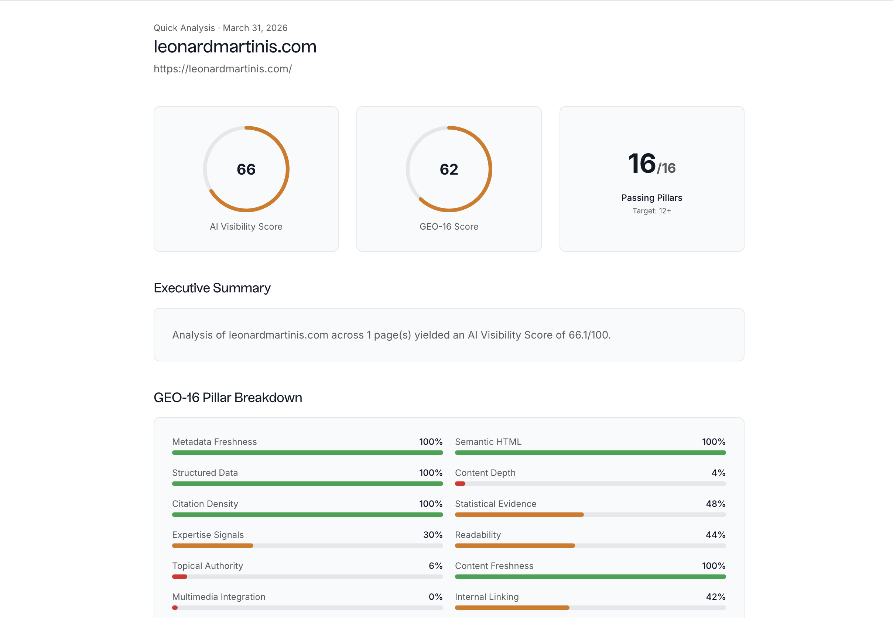

<!-- CiteDom organization profile — place this repo at github.com/<org>/.github -->

  

  <strong>Quick Analysis</strong> · AI Visibility · GEO-16 · Executive summary · Pillar-level breakdown

  
  &nbsp;
  

 

<h1 align="center">CiteDom</h1>

  <b>Help brands get cited by AI—not just ranked in traditional search.</b>

  <a href="https://citedom.com">CiteDom</a> builds tools for <b>Generative Engine Optimization (GEO)</b>—AEO / conversational SEO—so teams can see how ChatGPT, Perplexity, Google AI Overviews, and similar systems treat their content, and what to change.

 

## What we focus on

| | |
| :--- | :--- |
| **Citation-oriented quality** | Sites are scored against **GEO-16**: sixteen on-page signals tied in research to AI answer engines citing your pages. |
| **Research-backed** | We ground recommendations in peer-reviewed GEO, citation behavior, and competitive dynamics—not generic SEO folklore. |
| **Actionable output** | You get prioritized, specific fixes—not a vague “improve your content” checklist. |

 

<b>Research we build on</b> &nbsp;·&nbsp; papers &amp; preprints

 

| Topic | Reference |
| --- | --- |
| Foundational GEO strategies | [GEO (arXiv:2311.09735)](https://arxiv.org/abs/2311.09735) |
| GEO-16 auditing & citation behavior | [GEO-16 (arXiv:2509.10762)](https://arxiv.org/abs/2509.10762) |
| Multimodal GEO | [arXiv:2511.04080](https://arxiv.org/abs/2511.04080) |
| AutoGEO | [arXiv:2510.11438](https://arxiv.org/abs/2510.11438) |
| C-SEO Bench | [arXiv:2506.11097](https://arxiv.org/abs/2506.11097) |
| CORE & attention in AI search | [arXiv:2602.03608](https://arxiv.org/abs/2602.03608), [arXiv:2601.01750](https://arxiv.org/abs/2601.01750) |

 

## Open source

This organization hosts public tooling and experiments around GEO analysis, reporting, and developer workflows. **Star** what you use; **open an issue** when something breaks or you want a feature.

 

  <a href="https://citedom.com"><b>citedom.com</b></a>
  &nbsp;·&nbsp;
  Analyze your site’s AI visibility and get a structured report aligned with GEO-16.

  CiteDom — visibility in the age of AI answer engines.

